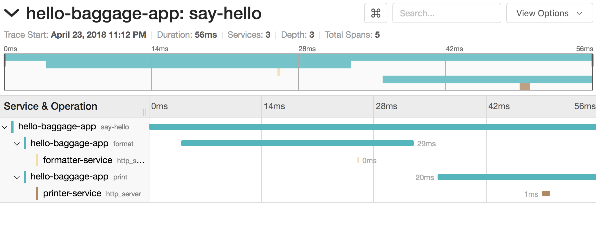
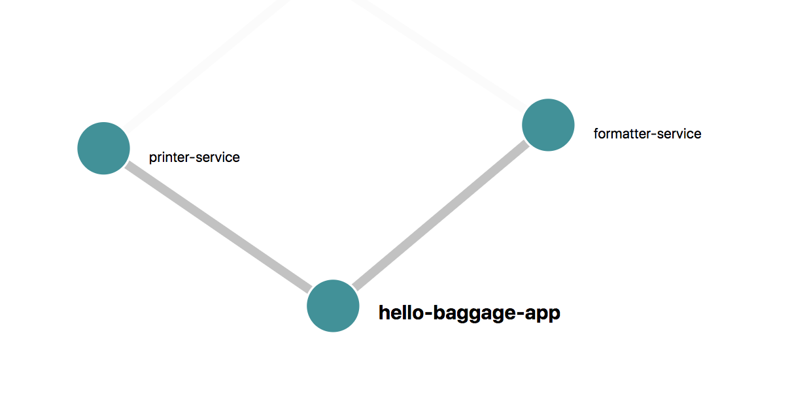

# OpenTracing Tutorials for Node.js
A collection of tutorials for the OpenTracing API (http://opentracing.io/). This tutorials are using Jeager as Tracing backend.

```
docker run -d -p5775:5775/udp -p6831:6831/udp -p6832:6832/udp \
  -p5778:5778 -p16686:16686 -p14268:14268 -p9411:9411 jaegertracing/all-in-one:latest
```
Once the container starts, The Jaeger UI will be accessible at http://localhost:16686.


## Tutorials
- 00-hello: learn how to instantiate trace and create simple trace
- 01-function_trace: trace individual function nad combine multiple span into a single trace
- 02-rest_api_trace: Micro Service RPC style tracing
- 03-baggage: Pass data trough the trace and simplify context propagation with continuation-local-storage

## Sample Result




## Stack
- Node.js
- Typescript
- Jaeger & OpenTracing
- Request Promise
- Express